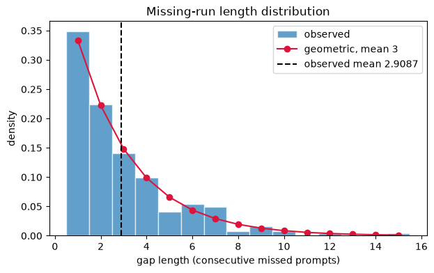
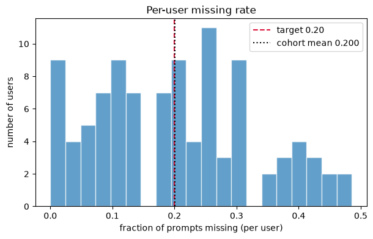
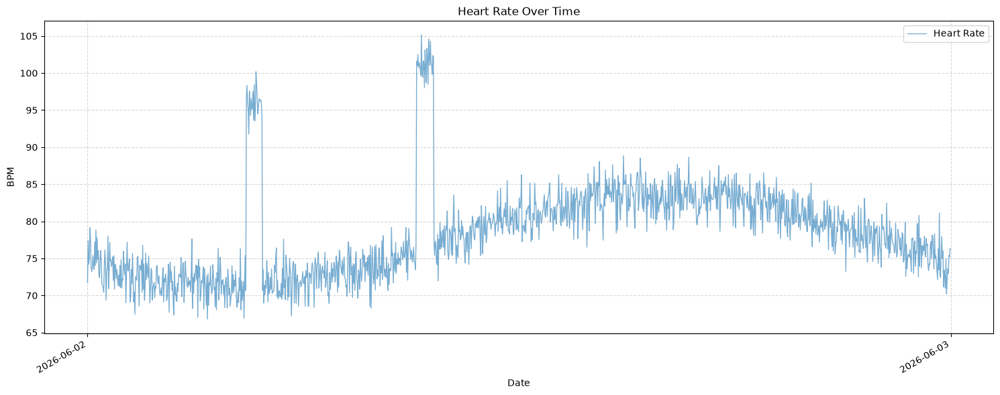
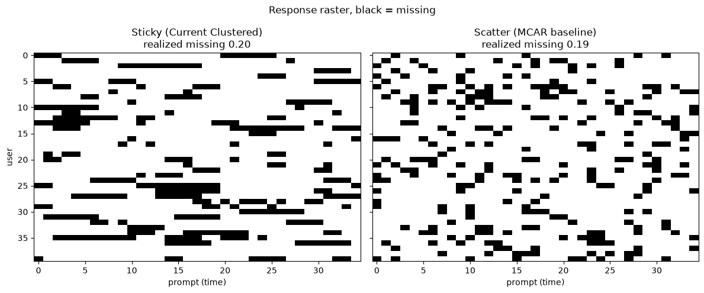
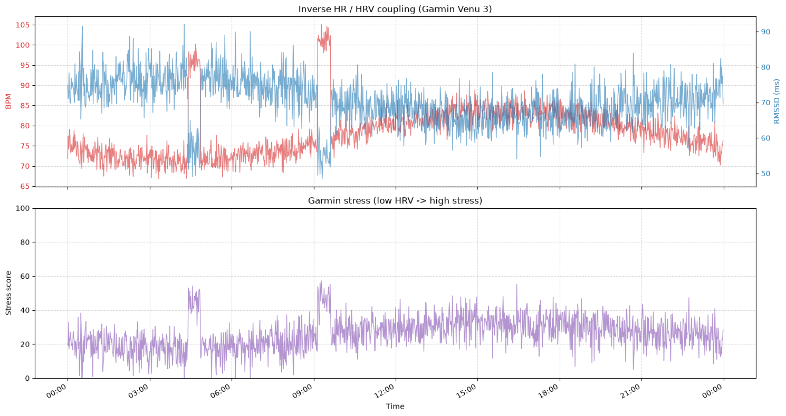
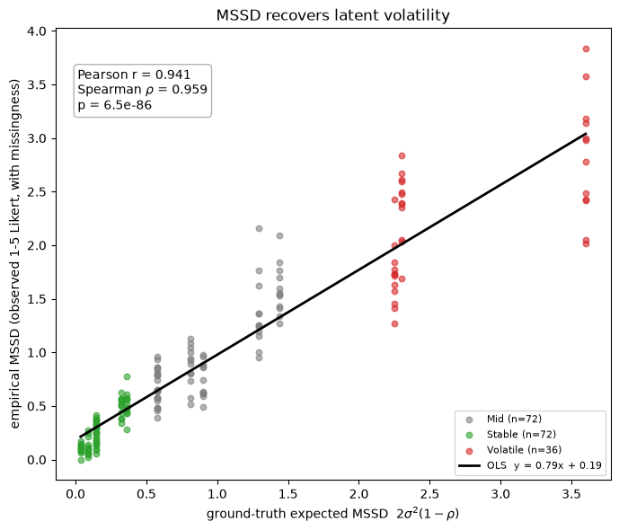
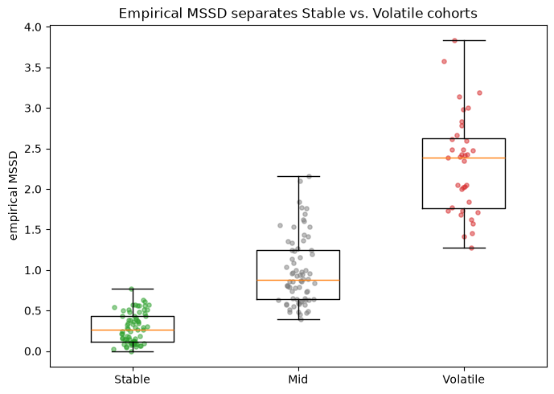

# syntheticData

*Tyler Le*

*Date: 06/02/2026*

[GITHUB](<https://github.com/tylerrleee/HealthyGatorSportFan/tree/mssd-tyler>)

Synthetic data generation for EMA (Ecological Momentary Assessment) and heart rate (HR) signals, used to validate MSSD (Mean of Squared Successive Differences) as a measure of temporal instability.

# Scope

We are focusing on qualitative (EMA) and quantitative simulation (HR + HRV + stress), so other quantitative values (steps, sleep, etc,..) are omitted for the purpose of simulation concept review and simplicity of debugging.

The wearable profile simulates the **Garmin** line (Venu 3 / Vivoactive 5/6) rather than Fitbit: heart-rate samples carry a `source` flag and an HRV value, and a Garmin-style 0–100 stress score is derived from continuous HRV.

## Quick start

```bash
pip install -r requirements.txt

python main.py             # generate a cohort + diagnostic plots -> figures/
python mssd_validation.py  # MSSD construct-validity check  -> figures/validation/
python db_seed.py --help   # push a cohort into the Django DB (see Phase 3 below)
```

## Files

### `main.py`

Generates a cohort of 100 synthetic users over 7 days, producing both EMA and heart rate DataFrames (DF). Runs all diagnostic plots and saves them to `figures/`.

In scope: Parameters can be tweaked to simulate different cohorts, producing a distinct DF. 

Out of scope: DF does not save. 

### `synthetic_generator.py`

Core data generation module. Contains two generators:

- **EMA Generator** — Produces per-user EMA time series with known latent volatility using an AR(1) process (see below about why AR(1)). 
    - Each user gets randomly drawn parameters (`mu`, `sigma`, `rho`) that serve as ground truth for validating MSSD. EMA values are mapped to a 1-5 Likert scale (for now). Missingness or no response is injected via randomness (`_clustered_missing_mask`) that produces realistic clustered gaps rather than random dropout.
    - No response are clustered, instead of purely random. Although this missingness can be controlled, it helps simualate the prolonged responsiveness of certain individuals
        - e.g. phone is on DND, has an exam, watching the Knicks winning NBA Finals, etc,..
    
  - `generate_user_ids()` - Creates unique UUIDs for each user.
  - `generate_user()` - Generates one user's EMA series with known latent parameters.
  - `generate_cohort()` - Generates the full cohort DataFrame.

  - `generate_user()` now accepts optional `mu` / `sigma` / `rho` so a caller can pin the latent volatility to a *known* value. This is how `mssd_validation.py` builds Stable vs. Volatile sub-cohorts.

- **Heart Rate / HRV / Stress Generator** — Produces minute-level HR data per user (random Gaussian noise + activity bouts), then derives HRV and stress. Resting HR is estimated from [60,100] for young adults.
  - `_generate_heart_rate()` — Generates one user's minute-level HR series, plus `hrv_rmssd`, `stress`, and a Garmin `source` column.
  - `_generate_hrv_and_stress()` — Ties HRV (RMSSD) inversely to HR — `RMSSD_t = α·(100 / HR_t) + ε_t` — so a high HR compresses the inter-beat interval (low HRV) and a resting HR elevates it. Garmin then maps continuous HRV onto a 0–100 stress score (low HRV → high stress), which makes exercise-bout HR spikes raise stress.
  - `generate_HR()` — Generates HR/HRV/stress for the full cohort, assigning each user a Garmin device model (`GARMIN_DEVICES`).
    - Parameters are tweakable in `synthetic_generator.py`

### `mssd_validation.py`

Construct-validity harness for MSSD (Phase 1). Generates sub-cohorts with **known** latent parameters across a (sigma, rho) grid, computes the empirical MSSD on the realised 1–5 Likert series (honouring the missingness mask — successive differences spanning a missed prompt are dropped), and regresses empirical MSSD against the ground-truth expected MSSD `2σ²(1-ρ)`. A strong positive correlation (Pearson r ≈ 0.94) is the construct-validity defence: MSSD recovers latent volatility despite Likert rounding and missingness. Writes plots to `figures/validation/`.

```bash
python mssd_validation.py
```

### `db_seed.py`

ETL / seed script (Phase 3). Uses **SQLAlchemy reflection** to bulk-insert a synthetic cohort into the **Django database** (the app owns the schema; run its migrations first). Inserts respect foreign-key order:

```
app_user → app_wearabledevice → app_heartratesample
                              → app_stresssample
app_user → app_ema   (missed prompts written explicitly as status='missed')
```

Synthetic users are tagged with an `@synthetic.gatorfan` email so `--reset` wipes a previous seed without touching real accounts. Target DB comes from `DATABASE_URL` (e.g. Heroku Postgres) or defaults to the local sqlite DB the Django migrations create.

```bash
# from HealthyGatorSportsFanDjango/, create the tables once:
#   DATABASE_URL=sqlite:///$(pwd)/synthetic_seed.sqlite3 python manage.py migrate

# then seed 100 mock users (downsamples HR to every 5th minute by default):
python db_seed.py --users 100 --days 7 --reset
DATABASE_URL=postgres://... python db_seed.py --users 100 --reset   # any Django DB
```

> Schema note: this added `source` + `hrv_rmssd` to `HeartRateSample`, a `status` field to `EMA`, and a new `StressSample` model on the Django side (migration `app/0025_…`).

#### First-Order Autoregressive Model

*['Autoregressions', Economics-With-R](<https://www.econometrics-with-r.org/14.3-autoregressions.html>)*

An autoregressive model relates a time series variable to its past values.

In our case, the goal is to 'model' a person's fluctuating psychological state, which is **dependent on the previous state**.

Formula:

$$
z_t = \rho * z_{t-1} + e_t
$$

$z_t$: User's state

$z_{t-1}$: User's state at the previous time step

$e_t$ : Random noise that influence user's state (e.g. FSU just scored, just took some cognac, hitting a PR)

e_t ~ $Normal(0, \sigma_{e^2})$ : random noise is Normally distributed.
  - On average, most noise are close to the mean, 0, but sometimes, depending $\sigma_{e^2}$, it can be influential

### `plotting.py`

Diagnostic visualizations for validating the synthetic data. All figures are saved to `figures/`.

- `plot_gap_histogram()` — Distribution of missing-run lengths vs. the expected geometric distribution.
- `plot_missing_rate_histogram()` — Per-user missing rate distribution compared to the target response rate.
- `plot_response_raster()` — Side-by-side raster comparing clustered (sticky) missingness against an MCAR baseline.
- `plot_heart_rate()` — Heart rate over time for a single user.

### `notebook/Tien_Le_MSSD_v1_0.ipynb`

Research notebook documenting the MSSD methodology

### `figures/`

Output directory for saved plots:

- `gap_histogram.png` - Missing-run length distribution.



- `missing_rate_histogram.png` - Per-user missing rate histogram.



- `heart_rate_analysis.png` - Sample heart rate time series.



- `response_raster.png` - Sticky vs. scatter missingness raster.



- `hrv_stress_analysis.png` - Inverse HR/HRV coupling + derived Garmin stress for one user.



### `figures/validation/`

MSSD construct-validity output (`mssd_validation.py`):

- `mssd_recovery.png` - Empirical MSSD vs. ground-truth expected MSSD, with OLS fit and Pearson/Spearman correlations.



- `mssd_group_separation.png` - Empirical MSSD distributions for Stable / Mid / Volatile cohorts.



